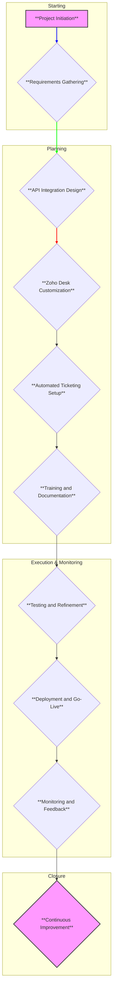

```mermaid
graph TD
    A[**Project Initiation**] --> B{**Requirements Gathering**}
    B --> C{**API Integration Design**}
    C --> D{**Zoho Desk Customization**}
    D --> E{**Automated Ticketing Setup**}
    E --> F{**Training and Documentation**}
    F --> G{**Testing and Refinement**}
    G --> H{**Deployment and Go-Live**}
    H --> I{**Monitoring and Feedback**}
    I --> J{**Continuous Improvement**}

    subgraph Starting
    A
    B
    end

    subgraph Planning
    C
    D
    E
    F
    end

    subgraph Execution & Monitoring
    G
    H
    I
    end

    subgraph Closure
    J
    end

    style A fill:#f9f,stroke:#333,stroke-width:2px
    style J fill:#f9f,stroke:#333,stroke-width:2px

    linkStyle 0 stroke:#00f,stroke-width:2px
    linkStyle 1 stroke:#0f0,stroke-width:2px
    linkStyle 2 stroke:#f00,stroke-width:2px
```

